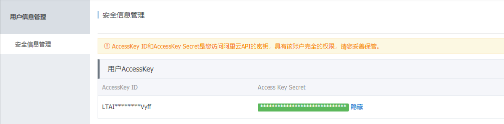

# ddns-aliyun

基于阿里云 CLI 实现的一个 DDNS 工具。

## Features

- 支持随系统引导自动启动（由 `systemd` 管理）
- 支持定时查询公网 IP 地址并在变化时更新解析记录

## Using

**声明：由于本软件使用 root 权限运行，故务必按照步骤指示操作，若不按步骤指示操作所造成的一切后果皆自负！**

**声明：本软件仅供学习参考之用，若将该软件用于生产环境时，请务必检查该软件的缺陷与安全性，否则所造成的一切后果自负！**

1. 安装阿里云 CLI 到 `/usr/bin` 目录

        curl -O https://aliyuncli.alicdn.com/aliyun-cli-linux-3.0.16-amd64.tgz
        tar -zxf aliyun-cli-linux-3.0.16-amd64.tgz
        sudo cp aliyun /usr/bin

2. 安装依赖软件

        sudo yum install -y jq

3. 克隆项目并运行 `install.sh` 进行安装

        git clone git@github.com:hamflx/ddns-aliyun.git
        sudo ./install.sh

4. 配置 `AccessKey ID` 及 `Access Key Secret`

    进入阿里云 accesskeys 管理页面，生成一个 `AccessKey`。

    

    

        sudo vim /etc/ddns/aliyun/config.json

    编辑 `/etc/ddns/aliyun/config.json` 将 `<AccessKey ID>` 与 `<Access Key Secret>` 替换为在阿里云上生成的 `AccessKey` 的 `AccessKey ID` 与 `Access Key Secret`。

        {
            ...
            "profiles": [
                {
                    ...
                    "access_key_id": "<AccessKey ID>",
                    "access_key_secret": "<Access Key Secret>",
                    ...
                }
        }

5. 配置 ddns.conf

    编辑 `RECORD_RR` 的值为需要解析的记录，`RECORD_DOMAIN` 顶级域名。

        sudo vim /etc/ddns/ddns.conf

    例如：

        # 需要操作的域名
        RECORD_RR="www"
        RECORD_DOMAIN="njstee.com"

6. 添加域名

    在阿里云控制台添加需要解析的域名记录，值为任意即可，在启动软件后会自动获取公网 IP 并进行设置。

    

7. 启动 ddns-aliyun

    启动 ddns-aliyun 进行测试，若提示 `Updated successfully` 或 `Already latest` 则表示运行成功：

        sudo /usr/bin/ddns.sh

    启动 ddns-aliyun 并将其设置为随系统引导一起启动：

        sudo systemctl enable --now ddns.service

## License

